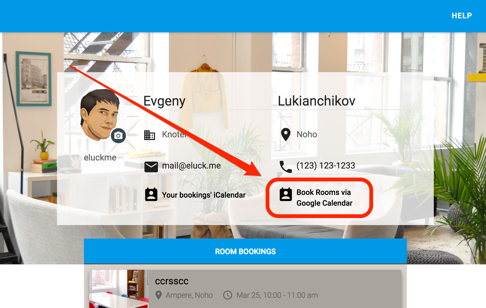

This is a guide explaining how to set up and use rooms booking via Google Calendar. The feature allows you book conference rooms by just "inviting" them to events from your calendar just like usual attendees.

The guide assumes that you'll use an account  belonging to a Google Apps for Work domain. To set up the feature, head your knotel profile page https://knotel.com/profile and click "Book Rooms via Google Calendar" link.

The popped up guide will help you subscribing to calendars of the conference rooms you’re interested in. In the popup, select a property and floors where the conference rooms located and press “Add” button.

You can remove rooms you don’t want to subscribe to by pressing “x” next to room name. Then press “Apply” button to share and Google Calendars of the rooms with your Google Account about which you’ll get a number of email notifications from Google. The set up complete!

Now you can head to your Google Calendar and see rooms calendars appeared in “Other calendars” section.

To book a room from a Google Calendar create an event in your own calendar and “invite” a room in your event as a usual attendee.

If your booking conflicts with an existing booking, the room will decline your invitation. Otherwise it will accept it an a new booking will appear in your Knotel account.

You can update bookings details by changing events' properties: start date, length, attendees set, title, etc. Please note that deletion of an event won't effect in the corresponding booking cancellation.

If you have any questions, ping GM of your property for help.
